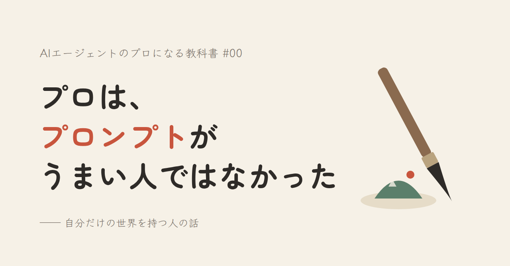
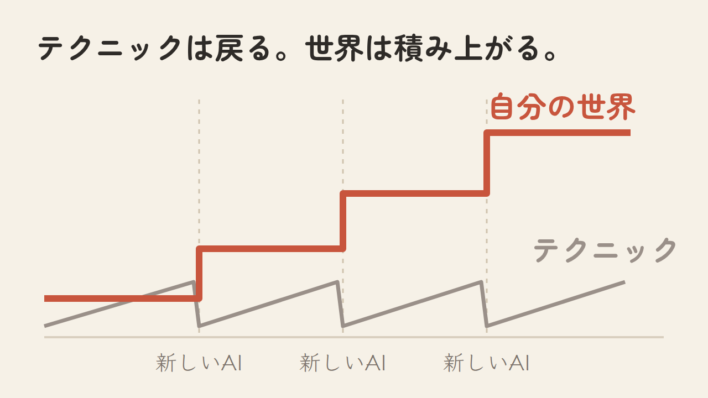
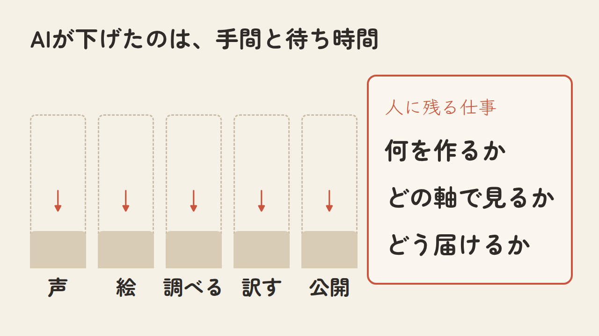
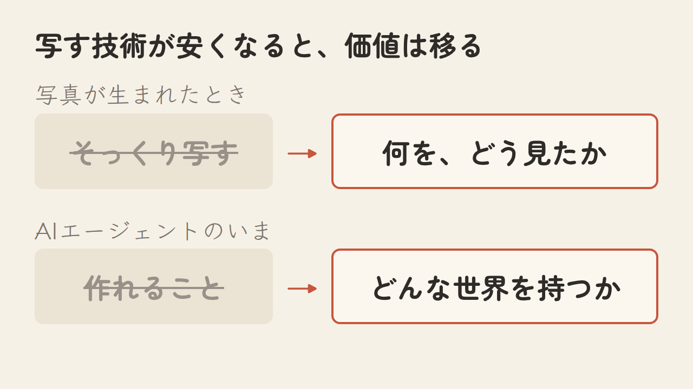
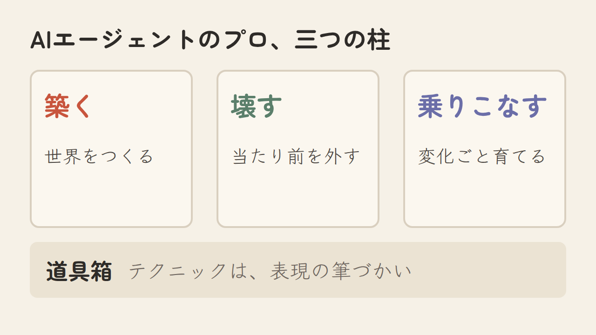
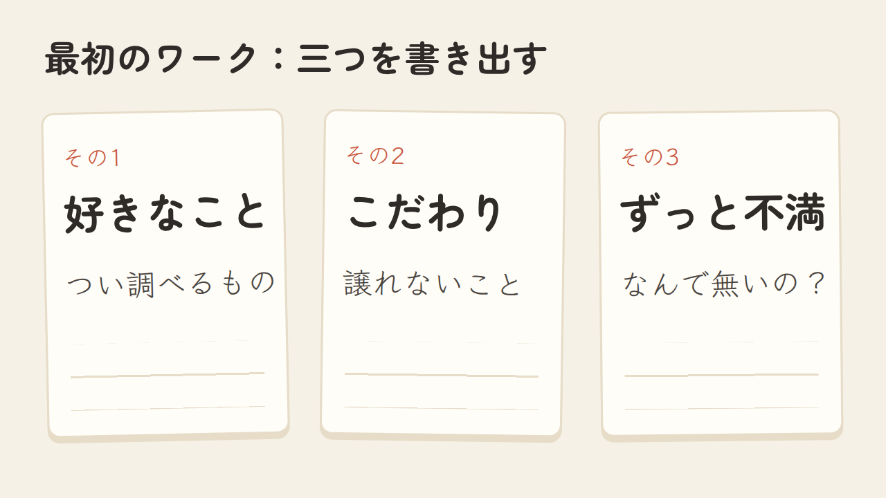

<!--
【編集メモ — note には貼らない】
- 連載「AIエージェントのプロになる教科書」#00（無料）
- 書き方の根拠：WRITING_RULES.md（冒頭に細かい数字を出さない）、research/note_style.md（人気noteの文体とAIっぽさの分析）
  - 具体的な一場面から入る／大見出し5つ／段落は2〜3文／太字は1か所／引用は1か所／まとめの節を作らない
  - 「重要です」「言えるでしょう」「さらに」「これにより」「結論から言うと」「まとめると」を使わない
- 図：figures/ の PNG（1280×720。見出し画像だけ 1280×670）。各図は、説明している段落のすぐ下に置く
- 引用「これは表現の限界ではなく、手配の限界でした」は method/ichinichi-novel-pipeline.html の原文
- 「平日の夜と週末」は作業の記録の時刻で確認済み／「進捗管理」は作者の言葉
- note の目次機能をオンにする
- ハッシュタグ：#AIエージェント #ClaudeCode #生成AI #仕事術 #AIとやってみた
-->

# プロは、プロンプトがうまい人ではなかった

帰りの電車で、スマホを開く。
「新しいAIが出た」「このプロンプトがすごい」。今日も、知らない言葉が流れてきます。

とりあえず保存して、そのまま閉じる。保存したきり一度も開いていない記事が、たぶん何十本もある。

追いかけるほど、自分だけ置いていかれる気がする。そんな感覚に、覚えはないでしょうか。

## テクニックは、すぐ古くなる

プロンプトの書き方。Skill の作り方。RAG の組み方。どれも大事で、この連載でもちゃんと扱います。

ただ、テクニックは長持ちしません。前は工夫しないと出なかったものが、次のモデルでは普通に頼めば出てくる。前は通った書き方が、ある日から通らなくなる。

覚えるたびに、振り出しに戻る。でも、自分で作ったものは消えません。次のAIが来ても、その上にまた積み上げられます。

## 会社員の、夜と週末の話

私は会社員です。この春から、仕事のかたわら、AIエージェントと一緒にものを作ってきました。記録を見返すと、手を動かしていたのは、ほとんどが平日の夜と週末でした。

書いた物語を、声のある、遊べるゲームにしました。旅に行けない日のために、見回せる場所を作りました。好きな音楽から、まだ知らない音楽に出会える地図も作っています。

どれも、私ひとりの「好き」や「ずっと不満だったこと」から始まりました。声優でも、3Dの職人でも、作曲家でもありません。

ここで覚えたことは、会社の仕事にも戻ってきています。たとえば、仕事の進捗管理を、AIでできるようになりました。

## AIがしてくれたのは、一つだけ

作っているあいだ、何度も同じことに気づきました。AIは、物語を面白くはしてくれない。何を並べるか、どこで心を動かすかも、決めてはくれません。

AIがしてくれたのは、手間と待ち時間を安くすることでした。声を入れる手配、絵を描く時間、調べものの山、訳す手間、公開までの段取り。そういう壁が、一つずつ低くなっていきました。

物語をゲームにしたとき、私はノートにこう書いています。

> これは表現の限界ではなく、手配の限界でした。

壁が下がったあとに残ったのは、何を作るか、どの軸で見るか、どう届けるか。そこだけは、最後まで私が決めています。

## 写真が生まれたときの話

よく語られる話があります。写真が生まれると、見たものをそっくり写す仕事は、写真に移っていきました。

そこから絵は「自分にはこう見える」を描く方へ向かい、かえって自由になった、と言われます。写す技術が安くなって、価値が「何を、どう見たか」に移ったわけです。

いま、同じことが、文章にも、声にも、絵にも、調べものにも起きています。

だから私は、AIエージェントのプロを、こう考えるようになりました。

**プロとは、道具の使い方がうまい人ではなく、自分だけの世界を持っている人。**

その世界を深く、速く築いて、形にできる人。これまでの「当たり前」を、AIで外せる人。AIが変わるたびに、世界ごと育てていける人。プロンプトのテクニックは、その表現を支える筆づかいのひとつです。

## あなたの世界は、もう手元に

「世界」と聞くと、大げさに聞こえるかもしれません。でも私の場合、始まりはとても小さな不満でした。

ひとりで店に入りたいとき、入りやすいかどうかを、誰も教えてくれない。その不満から、全国の店を「ひとりで入れるか」で並べ直した地図が生まれました。

仕事にも、同じ種があります。業界で当たり前になっている物差し。誰かを待たないと進まなかった作業。「本当はこうしたいのに」と思いながら、手が回らずにいたこと。

この連載では、そういう種を、AIエージェントと一緒に育てていきます。築く、壊す、乗りこなす。毎回、私が実際に作ったものの一場面から始めて、最後に、あなたが手を動かすワークを置きます。テクニックは「道具箱」として別に書き、古くなったら書き直します。

最初のワークは、これです。

好きなこと。こだわり。ずっと不満だったこと。スマホのメモに、一行ずつで構いません。

次回は、しまい込んだままの企画の話をします。「いつか、誰かと組めたら」と思っているものが、ひとつくらい、ありませんか。
